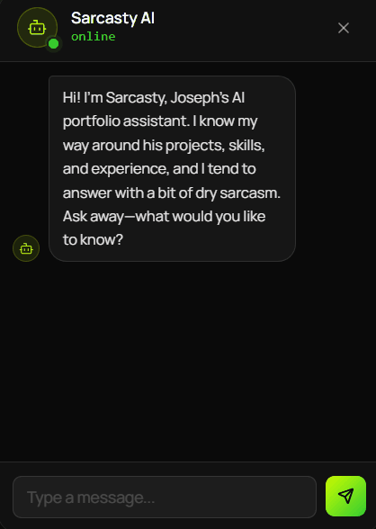
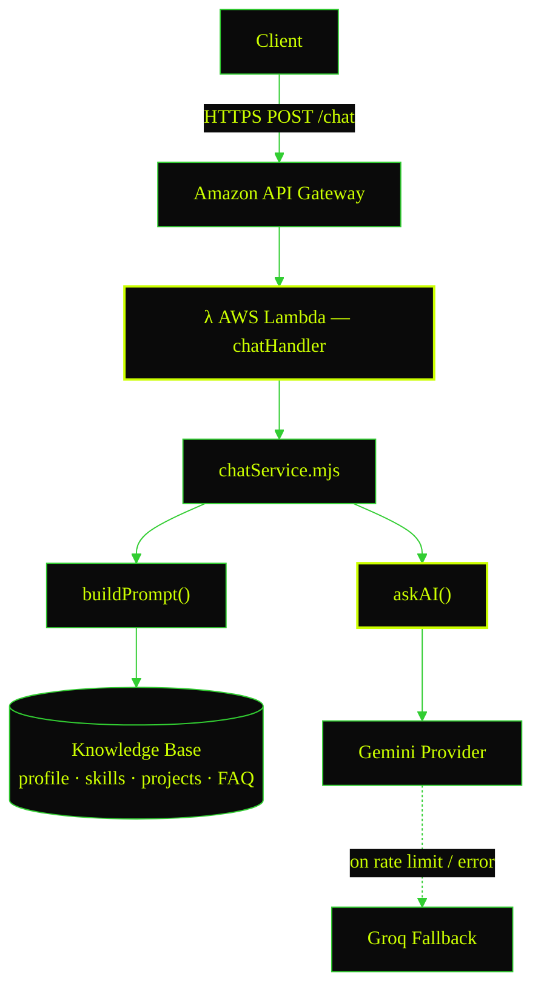
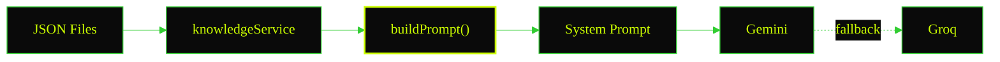

<div align="center">
  

<em>Dry humor. Reliable answers. Zero tolerance for unrelated questions.</em>

<br/>


<br/><br/>

[](https://sarcasty.xyz)
[](https://sarcasty.vercel.app)

</div>

---

<div align="center">
  
</div>

---

## Table of Contents

- [Overview](#overview)
- [Features](#features)
- [Project Goals](#project-goals)
- [Tech Stack](#tech-stack)
- [Project Structure](#project-structure)
- [Architecture](#architecture)
- [Knowledge Base](#knowledge-base)
- [API Reference](#api-reference)
- [Local Development](#local-development)
- [Testing](#testing)
- [Deployment](#deployment)
- [Design Decisions](#design-decisions)
- [Future Improvements](#future-improvements)

---

## Overview

Sarcasty is the backend service powering the AI assistant on my personal portfolio website. Rather than functioning as a general-purpose chatbot, it is specifically designed to answer questions about **my projects, technical skills, professional experience, education, and contact information**.

The chatbot grounds every response using a structured JSON knowledge base before generating answers with large language models. To improve reliability, it automatically falls back to a secondary AI provider whenever the primary provider is unavailable or reaches its rate limit.

Built with a serverless architecture on AWS, the project explores prompt engineering, AI integration, REST API design, and cloud-native application development while keeping the system lightweight, maintainable, and easy to extend.

---

## Features

- AI-powered portfolio assistant focused exclusively on portfolio-related questions.
- Structured JSON knowledge base for projects, skills, experience, FAQs, and contact information.
- Automatic AI provider fallback (Google Gemini → Groq).
- Serverless architecture using AWS Lambda and Amazon API Gateway.
- Lightweight REST API built with Node.js.
- Unit tested with Vitest.
- Easily extensible by updating JSON knowledge files.
- Stateless by design — no conversation history is stored between requests.
- A dry, sarcastic personality to make interactions a little more entertaining.

---

## Project Goals

This project was built to:

- Learn and apply serverless application development using AWS.
- Explore prompt engineering with structured contextual knowledge.
- Build a maintainable backend that can support multiple AI providers.
- Design a chatbot that stays focused on a single domain instead of attempting to answer general knowledge questions.
- Create a production-ready backend suitable for integration with a personal portfolio.

---

## Tech Stack

<div align="center">

| Category        | Technologies                   |
| --------------- | ------------------------------ |
| Runtime         | Node.js                        |
| Cloud           | AWS Lambda, Amazon API Gateway |
| Infrastructure  | AWS SAM                        |
| AI Providers    | Google Gemini, Groq            |
| Testing         | Vitest                         |
| Frontend Client | React, Axios                   |

</div>

> **Note:** Sarcasty is **not** a Retrieval-Augmented Generation (RAG) system. Instead, it uses a lightweight structured JSON knowledge base that's dynamically injected into prompts before each request, making it simple, maintainable, and well-suited for a personal portfolio.

---

## Project Structure

Sarcasty is organized into modular layers, separating request handling, business logic, AI providers, prompt generation, and portfolio data. This keeps the codebase easy to understand, test, and extend.

```text
portfolio_chatbot/
├── src/
│   ├── config/          # Shared configuration and model definitions
│   ├── data/             # Portfolio knowledge base (JSON)
│   ├── handlers/         # AWS Lambda entry points
│   ├── lib/              # Prompt building and data loading
│   └── services/         # Chatbot logic and AI providers
│       └── ai/           # Gemini and Groq integrations
│
├── __tests__/            # Unit tests
├── events/                # Sample API Gateway events
├── assets/                # Documentation assets
├── deploy.ps1             # Automated deployment script
├── buildspec.yml          # AWS CodeBuild pipeline
├── server.mjs             # Local development entry point
└── template.yaml          # AWS SAM infrastructure
```

### Directory Overview

| Path               | Responsibility                                                                                                                              |
| ------------------ | ------------------------------------------------------------------------------------------------------------------------------------------- |
| `src/config/`      | Environment configuration, CORS settings, and AI model definitions.                                                                         |
| `src/data/`        | Structured JSON knowledge base containing portfolio information such as projects, skills, education, experience, FAQs, and contact details. |
| `src/handlers/`    | AWS Lambda entry points exposed through Amazon API Gateway.                                                                                 |
| `src/lib/`         | Builds prompts and loads portfolio knowledge before requests are sent to an AI provider.                                                    |
| `src/services/`    | Core chatbot business logic, including AI provider orchestration and knowledge retrieval.                                                   |
| `src/services/ai/` | Integrations for Google Gemini and Groq, including automatic fallback handling.                                                             |
| `__tests__/`       | Unit tests covering handlers, prompt generation, services, and utilities.                                                                   |
| `events/`          | Sample payloads for local testing with AWS SAM.                                                                                             |
| `assets/`          | Documentation assets (demo gif, etc).                                                                                                       |
| `deploy.ps1`       | PowerShell script automating the SAM build-and-deploy workflow.                                                                             |
| `buildspec.yml`    | AWS CodeBuild pipeline definition for CI/CD.                                                                                                |
| `server.mjs`       | Local dev server entry point, mirrors Lambda behavior outside AWS.                                                                          |
| `template.yaml`    | AWS SAM template defining Lambda functions, API Gateway routes, and permissions.                                                            |

---

## Architecture

Sarcasty follows a lightweight serverless architecture designed around simplicity, scalability, and low operational cost. Each request is handled independently without storing conversation history, making the service stateless and easy to scale.



### Request Lifecycle

Every incoming request follows the same pipeline:

1. The Client sends a question to the REST API.
2. API Gateway forwards the request to the `chatHandler` Lambda function.
3. The chatbot loads its structured knowledge base from JSON files.
4. A system prompt is dynamically generated using the available portfolio information.
5. The request is sent to Google Gemini.
6. If Gemini is unavailable or rate-limited, the request automatically falls back to Groq.
7. The generated response is returned to the frontend.

### Architectural Decisions

| Principle                      | What it means                                                                                                                                                                                                                              |
| ------------------------------ | ------------------------------------------------------------------------------------------------------------------------------------------------------------------------------------------------------------------------------------------ |
| **Domain-Specific AI**         | Sarcasty is intentionally limited to answering questions about my portfolio. General-purpose questions are politely declined to keep responses focused and accurate.                                                                       |
| **Stateless Architecture**     | The chatbot does not store conversations or user information. Every request is processed independently using only the current message and the portfolio knowledge base.                                                                    |
| **Provider Redundancy**        | Multiple AI providers improve reliability. If the primary provider becomes unavailable or exceeds its usage limits, requests automatically fall back without requiring frontend changes.                                                   |
| **Lightweight Knowledge Base** | Instead of introducing databases or vector stores, Sarcasty relies on curated JSON files that are version-controlled alongside the source code. This keeps maintenance simple while providing sufficient context for a personal portfolio. |

---

## Knowledge Base

Unlike general-purpose chatbots, Sarcasty answers questions using a structured portfolio knowledge base. Rather than retrieving information from external sources, the chatbot builds a contextual prompt from curated JSON files before sending each request to the AI provider.

### Knowledge Sources

```text
data/
├── profile.json
├── skills.json
├── experience.json
├── education.json
├── projects.json
├── achievements.json
├── contacts.json
└── faq.json
```

Each file represents a single domain of information, making the knowledge base easy to maintain and update independently.

| File                | Purpose                           |
| ------------------- | --------------------------------- |
| `profile.json`      | Personal introduction and summary |
| `skills.json`       | Technical skills and proficiency  |
| `experience.json`   | Professional experience           |
| `education.json`    | Academic background               |
| `projects.json`     | Portfolio projects                |
| `achievements.json` | Awards and accomplishments        |
| `contacts.json`     | Contact information               |
| `faq.json`          | Frequently asked questions        |

### Prompt Generation

Before every AI request:

1. The required JSON files are loaded.
2. Portfolio data is merged into a structured context.
3. System instructions defining Sarcasty's personality are added.
4. The completed prompt is sent to the AI provider.



This approach ensures responses remain grounded in the latest portfolio information while keeping the knowledge base version-controlled alongside the source code.

### Why JSON Instead of a Database?

For a personal portfolio, a structured JSON knowledge base provides several advantages:

- Lightweight with zero infrastructure overhead
- Easy to edit without database migrations
- Version controlled alongside the source code
- Fast enough to load entirely within a Lambda invocation
- Simple to extend by adding new knowledge files

This design intentionally favors maintainability over complexity while providing sufficient context for the chatbot.

---

## API Reference

Sarcasty exposes two REST endpoints through Amazon API Gateway.

| Method | Endpoint | Description                                                  |
| ------ | -------- | ------------------------------------------------------------ |
| `GET`  | `/`      | Health check — confirms the backend is online and reachable  |
| `POST` | `/chat`  | Sends a message and returns a portfolio-grounded AI response |

### Health Check

Checks whether the backend is online and reachable.

**Request**

```http
GET /
```

**Response**

```json
{
  "success": true,
  "text": "Hi! I'm Sarcasty, Joseph's AI portfolio assistant. I know my way around his projects, skills, and experience, and I tend to answer with a bit of dry sarcasm. Ask away—what would you like to know?"
}
```

### Chat

Generates a response grounded in the portfolio knowledge base.

**Request**

```http
POST /chat
```

**Body**

```json
{
  "message": "Tell me about Joseph's weakness."
}
```

**Successful Response**

```json
{
  "success": true,
  "model": "gemini-3.5-flash",
  "text": "Hi. Surprisingly, weaknesses isn't in my database, probably because he forgot to program his flaws into me. You'll have to contact Joseph directly if you want him to confess his secrets."
}
```

Sarcasty only answers based on available portfolio information. If a topic is not covered by the knowledge base, it responds without inventing personal details.

**Provider Failure Response**

If all AI providers are unavailable or exceed their rate limits:

```json
{
  "success": false,
  "error": "Well... every AI brain I rely on has called it a day and hit its daily limit. Try again tomorrow when they've had their beauty sleep, or contact Joseph directly if it's urgent."
}
```

> The `model` field indicates which AI provider generated the response. If the primary provider is unavailable, the request is automatically retried using the fallback provider.

---

## Local Development

### Prerequisites

Before running the project locally, ensure the following are installed:

- Node.js 24+
- AWS CLI
- AWS SAM CLI
- Git

### Clone the Repository

```bash
git clone https://github.com/JosephTiglao/sarcasty-portfolio-chatbot.git
cd sarcasty-portfolio-chatbot
```

### Install Dependencies

```bash
npm install
```

### Configure Environment Variables

Create a `.env` file for local development and provide the required API keys and CORS configuration.

```env
GEMINI_API_KEY=xxxxxxxxxxxxxxxx
GROQ_API_KEY=xxxxxxxxxxxxxxxx
ALLOWED_ORIGINS=https://sample.vercel.app,http://localhost:5173
```

### Environment Variables

| Variable          | Purpose                                                                          |
| ----------------- | -------------------------------------------------------------------------------- |
| `GEMINI_API_KEY`  | API key used for the primary Google Gemini provider.                             |
| `GROQ_API_KEY`    | API key used for the fallback Groq provider.                                     |
| `ALLOWED_ORIGINS` | Comma-separated list of frontend domains allowed to access the API through CORS. |

> A `.env.example` file is provided for reference. Replace placeholder values with your own credentials before running the project.

> Never commit `.env` files or expose API keys publicly. For AWS deployment, configure these values using Lambda environment variables or AWS Secrets Manager instead.

### Run Locally

**Option A — SAM local (closest to production, requires Docker):**

```bash
sam build
sam local start-api
```

The API will be available at `http://127.0.0.1:3000`.

**Option B — Node directly (lighter, no Docker):**

```bash
node server.mjs
```

Use this when you just want to iterate on `chatService.mjs` or prompt logic without waiting on SAM/Docker to spin up.

### Run Unit Tests

```bash
npm test
```

### Test the API

Health endpoint:

```bash
curl http://127.0.0.1:3000/
```

Chat endpoint:

```bash
curl -X POST http://127.0.0.1:3000/chat \
  -H "Content-Type: application/json" \
  -d '{"message":"Tell me about Joseph"}'
```

---

## Testing

Sarcasty uses **Vitest** for unit testing. External AI providers are fully mocked to ensure tests remain deterministic, fast, and independent of network availability.

Current test coverage includes:

- Prompt generation
- Knowledge loading
- Chat handler
- Gemini provider
- Provider fallback logic
  Run all tests:

```bash
npm test
```

Watch mode:

```bash
npm run test:watch
```

The testing strategy focuses on business logic rather than external AI responses, allowing the chatbot behavior to be verified without consuming API quotas.

---

## Deployment

Sarcasty is deployed as a fully serverless application using AWS.

### Infrastructure

- AWS Lambda
- Amazon API Gateway
- AWS SAM
- AWS CloudFormation
  Infrastructure is defined declaratively in `template.yaml`.

### Deploy

Build the application:

```bash
sam build
```

Deploy:

```bash
sam deploy --guided
```

Or use the deployment helper:

```powershell
./deploy.ps1
```

After deployment, AWS SAM outputs the API Gateway endpoint that can be used by the frontend. Example:

```
https://xxxxxxxx.execute-api.ap-southeast-1.amazonaws.com/Prod
```

---

## Design Decisions

Building Sarcasty started as a way to learn AWS Lambda, AWS SAM, and serverless application development while exploring practical AI integration.

The architecture was intentionally kept lightweight and maintainable, focusing on clear separation of responsibilities, reliable AI responses, and minimal infrastructure overhead.

### Why Serverless?

AWS Lambda removes the need to manage servers while automatically scaling based on demand.

Since a personal portfolio chatbot typically receives low and unpredictable traffic, a serverless architecture provides:

- Low operational overhead
- Pay-per-request pricing
- Automatic scaling
- Simple deployment through AWS SAM

### Why a JSON Knowledge Base?

The goal of Sarcasty was to create a portfolio-specific AI assistant, not a general knowledge chatbot.

Instead of introducing a database or additional infrastructure, portfolio information is stored in structured JSON files.

This approach provides:

- Easy content updates
- Version control alongside source code
- No database maintenance
- Fast loading during Lambda execution
- Simple and transparent data management

For a small, curated knowledge base, this approach provides enough context without unnecessary complexity.

### Why Multiple AI Providers?

AI providers can experience rate limits, outages, or temporary failures.

To improve reliability, Sarcasty uses a fallback strategy:

```text
Google Gemini
      |
      | unavailable / rate limit
      ↓
Groq
```

If the primary provider cannot complete a request, the system automatically attempts the fallback provider without requiring frontend changes.

### Why Stateless?

Sarcasty does not store conversation history.

Each request contains all required information:

- Chatbot instructions
- Portfolio knowledge
- User message

This keeps the application:

- Easier to deploy
- Easier to scale
- More privacy-friendly

### Why Not RAG?

RAG (Retrieval-Augmented Generation) was not used in this version of Sarcasty.

The primary goal of this project was to learn AWS Lambda, serverless architecture, and AI API integration. Since the portfolio knowledge base is small and changes infrequently, loading structured JSON data directly into the prompt was sufficient.

A RAG architecture could become valuable in future versions when:

- The knowledge base grows significantly
- More documents need to be indexed
- Semantic search becomes necessary
- External data sources are introduced

For the current use case, a lightweight prompt-grounding approach provides a simpler architecture with lower operational overhead.

---

## Future Improvements

Potential enhancements include:

- Conversation memory
- Streaming AI responses
- Administrative dashboard for editing portfolio data
- Authentication for private portfolio information
- Analytics and usage metrics
- Additional AI providers
- Optional RAG support for larger knowledge bases
- Automatic synchronization with GitHub repositories
- Semantic search over portfolio projects

---

<div align="center">

Built with ❤️ by **Joseph Tiglao**

If you found this project interesting, consider leaving a ⭐


</div>
